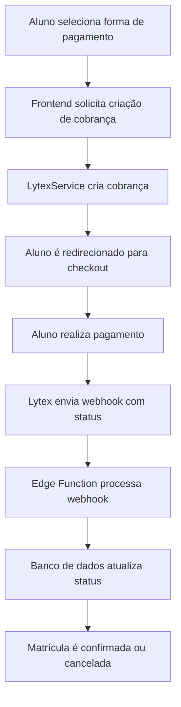

# Integração Lytex - Gateway de Pagamentos

## Visão Geral

A integração com a Lytex permite o processamento de pagamentos via cartão de crédito, boleto e PIX para o módulo de matrículas da Edunéxia. Esta documentação descreve os fluxos de integração, endpoints e principais funcionalidades.

## Estrutura da Integração

A integração é composta por:

1. **Serviço Lytex** (`services/lytexService.ts`) - Gerencia a comunicação com a API da Lytex
2. **Edge Function** (`edge-functions/lytex-webhook/index.ts`) - Processa webhooks enviados pela Lytex
3. **Schema do Banco** (`create-lytex-webhook.sql`) - Define tabelas e funções para armazenar e processar transações

## Fluxo de Pagamento



## Credenciais

As seguintes credenciais são necessárias para o funcionamento da integração:

- `CLIENT_ID` - Identificador do cliente na Lytex
- `CLIENT_SECRET` - Chave secreta de autenticação
- `LYTEX_WEBHOOK_SECRET` - Chave para validar a autenticidade dos webhooks

Estas credenciais devem ser configuradas como variáveis de ambiente:
- No ambiente de desenvolvimento: arquivo `.env`
- No ambiente de produção: configuração da Vercel e do Supabase

## Endpoints da API

### Obtenção de Token de Acesso

```
POST https://auth.lytex.com.br/oauth/token
```

Parâmetros:
- `client_id`
- `client_secret`
- `grant_type: client_credentials`

### Criação de Cobrança

```
POST https://api.lytex.com.br/v1/charges
```

Payload:
```json
{
  "amount": 10000,
  "description": "Matrícula Curso XYZ",
  "due_date": "2023-05-10",
  "customer": {
    "name": "Nome do Aluno",
    "email": "aluno@email.com",
    "tax_id": "12345678900"
  },
  "notification_url": "https://[project-ref].supabase.co/functions/v1/lytex-webhook"
}
```

### Consulta de Cobrança

```
GET https://api.lytex.com.br/v1/charges/{id}
```

## Webhook

A Lytex envia webhooks para notificar sobre eventos como:

- `payment.confirmed` - Pagamento confirmado
- `payment.refused` - Pagamento recusado
- `payment.refunded` - Pagamento estornado
- `payment.canceled` - Pagamento cancelado

O endpoint para receber webhooks é:
```
https://[project-ref].supabase.co/functions/v1/lytex-webhook
```

## Implementação no Banco de Dados

As seguintes tabelas são utilizadas:

- `pagamentos.transacoes` - Armazena informações sobre as transações
- `pagamentos.webhook_logs` - Mantém registro de todos os webhooks recebidos

## Testando a Integração

Para testar a integração localmente, utilize o script:

```bash
node scripts/teste-lytex.js
```

Este script realiza:
1. Autenticação com a API da Lytex
2. Criação de uma cobrança de teste
3. Consulta do status da cobrança

## Implantação

Para implantar a Edge Function no Supabase:

```bash
supabase functions deploy lytex-webhook
```

Após a implantação, configure as variáveis de ambiente no painel do Supabase:
- `SUPABASE_URL`
- `SUPABASE_SERVICE_ROLE_KEY`
- `LYTEX_WEBHOOK_SECRET`

## Troubleshooting

### Problemas comuns:

1. **Token expirado**: O token de acesso expira após 1 hora. O serviço deve renovar automaticamente.
2. **Webhook não processado**: Verifique os logs da função no Supabase Dashboard.
3. **Problemas de CORS**: A Edge Function inclui headers CORS para permitir integração com o frontend.

## Referências

- [Documentação Oficial da Lytex](https://docs.lytex.com.br)
- [Supabase Edge Functions](https://supabase.com/docs/guides/functions) 